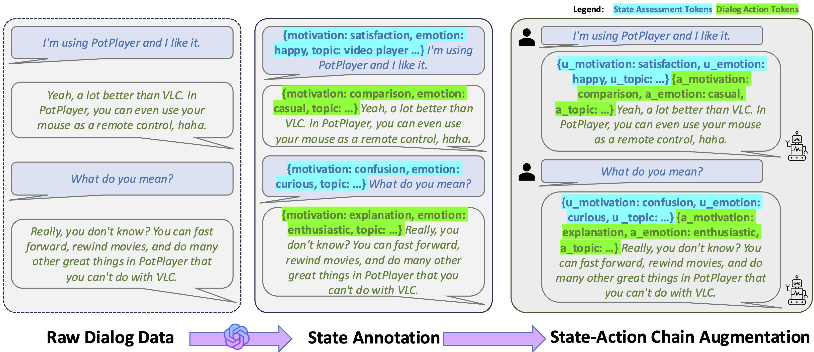

<p align="center" width="100%">

</p>

<!-- # SAGE  -->
[](https://huggingface.co/diffusionfamily)
[](https://arxiv.org/abs/2503.03040)

This software project accompanies the research paper, [SAGE: Steering and Refining Dialog Generation with State-Action Augmentation](https://arxiv.org/abs/2503.03040).

## Motivation
<div align="center">

</div>
Current dialog systems powered by LLMs may struggle with maintaining coherent long-term conversation flow. Our study proposes state-action augmentation to offer direct control over conversation directions.

We also use a self-improvement pipeline that integrates data augmentation, evaluation, tree search, and fine-tuning. This pipeline navigates diverse conversational pathways via dialogue utterance tree search, uses rejection sampling grounded on LLM-derived rewards, and refine the model based on the most efficacious trajectories. This pipeline showcases enhanced model performance.


## Dependency
### Model Training and Inference  
The model's training and inference are based on [LLaMA-Factory](https://github.com/hiyouga/LLaMA-Factory).  

### Base Checkpoint  
The base checkpoint is derived from the [Mixtral-8x7B Instruction model](https://huggingface.co/mistralai/Mixtral-8x7B-Instruct-v0.1).  

### Dialog Rollout Prompt  
The dialog rollout prompt is sourced from [EmpatheticDialogues](https://github.com/facebookresearch/EmpatheticDialogues).  


## Model checkpoint

The model checkpoint will be released soon.

## Getting Started

Run ``setup.sh`` to setup the environment and dependencies.
Set your APIs
```bash
export OPENAI_API_KEY=XXX
export HUGGINGFACE_TOKEN="hf_XXX"
huggingface-cli login --token $HUGGINGFACE_TOKEN
```


The training pipeline consists of the following steps:

1. Data Preparation:
```bash
bash example/run_make_data.sh
```

Add following to `LLaMA-Factory/data/dataset_info.json`

```json
  "data_mix": {
    "file_name": "mix.json",
    "formatting": "sharegpt",
    "columns": {
      "messages": "conversations"
    }
  },
```

2. Supervised Fine-tuning:
```bash
bash example/run_sft.sh
```

3. Dialog Tree Search:
```bash
bash example/run_search.sh
```

4. Preference Learning:
```bash
bash example/run_preference_learning.sh
```

5. Model Comparison:
```bash
bash example/run_comparison.sh
```

6. Inference:
```bash
bash example/run_inference.sh
```

Refer to the example/ folder for detailed configuration options for each step.

## Citation:
```bibtex
@article{zhang2025sage,
  title={SAGE: Steering and Refining Dialog Generation with State-Action Augmentation},
  author={Yizhe Zhang and Navdeep Jaitly},
  year={2025},
  eprint={2503.03040},
  archivePrefix={arXiv},
  primaryClass={cs.CL},
  url={https://arxiv.org/abs/2503.03040},
}
```
